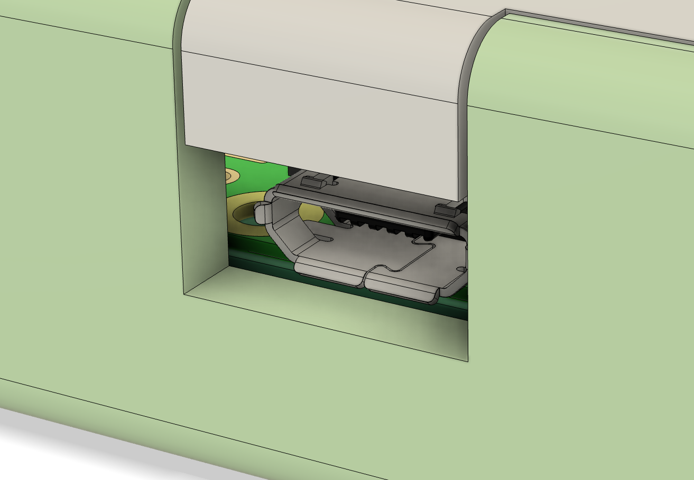
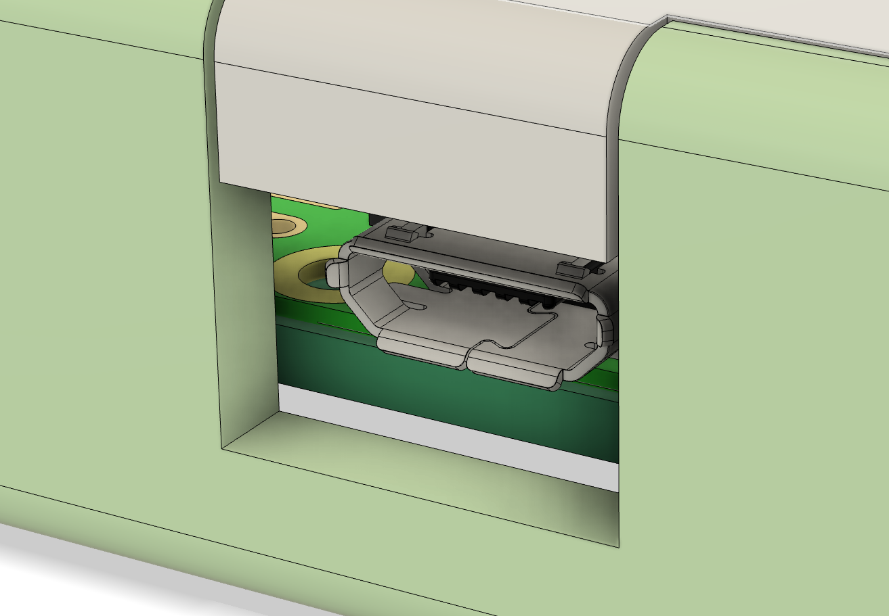

The enclosure models are available on Onshape for viewing, editing and exporting.
Printing with PLA+ may provide better strength than regular PLA.

** Variant 1 (Easier) - self tapping plastic threads. Easier to source.
Screws: Hex socket head cap, M2.5 x 10mm.  https://www.aliexpress.com/item/10000139502321.html
https://cad.onshape.com/documents/58d3fc7e6c256c4f6a684caf/v/919d1c8c2464819c6bc56821/e/96371cb25b019416be0a198b

** Variant 2 - metal threaded heat inserts
Heat threaded inserts: M2.5, 3.5mm OD, 3mm length.  https://www.aliexpress.com/item/4000688982018.html
Screws: Hex socket head cap, M2.5 x 10mm.  https://www.aliexpress.com/item/10000139502321.html
https://cad.onshape.com/documents/58d3fc7e6c256c4f6a684caf/v/9748de4b75ec777ad8fbd9ed/e/96371cb25b019416be0a198b

Important: Clean the 3D print to have a clean and flat surface for the TFT front surface interface.

*enclosure_metal_insert_threads_modified_usb_cutout.stl* and *enclosure_self_tapping_threads_modified_usb_cutout.stl*
have a larger cutout for the micro USB cable (7 x 11mm instead of 5 x 10mm). Both are untested.

